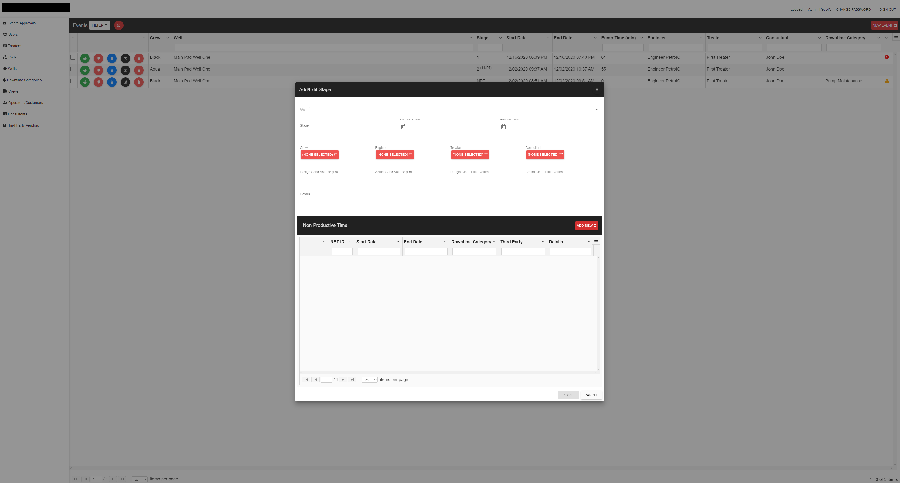

<h5><a href="https://www.linkedin.com/in/chris-vetter-00762b4/">LinkedIn</a></h5>
<h5><a href="https://github.com/ccvetter">Github</a></h5>
  
<h3>PETROIQ</h3>

<b>Project description</b>: PetroIQ is a software company created to provide business intelligence for oil companies throughout the US. The first of these companies was ProPetro in Midland, Texas. We created an application to keep track of maintenance and ongoing work at a variety of the company’s oil well locations. 

Below is a screenshot demonstrating how our app was used within the company. 
Each well is pre-planned through a number of stages involved in the drilling process. Our app was designed to track these stages and downtime within each stage (time tracking). The image below demonstrates adding a new stage to the well within this application as seen from the administrator view.

 

 
 
<em>This image shows event history – when each event was created, edited, approved or rejected.</em>

 

<em>Code sample of event approval:</em>
 
 
  
<h3>ALLYDVM</h3>

<b>Project description</b>: AllyDVM is a software company providing a client communications system for the veterinary industry. This software was built to automate the process of sending reminder postcards, text messages and emails between a veterinarian and her clients. It also provides a mobile app for clients to visualize appointments, request medication refills, and open a direct dialog with veterinary staff. The practice interface tracks analytics to the veterinary practice regarding client retention, staff production, overall practice productivity, client compliance, medical needs, and much more.

 
<em>Below is the home screen of AllyDVM for one of our clients, The Cat Doctors, in Tampa, Florida. From this screen, clients can navigate through email communications, directly message clients, look through analytics as well as reports for a variety of business needs. Each practice’s home screen is customizable to their particular preferences.</em>

  

The following demonstrate a few of the features I designed and developed while with this company (personal client information is blacked out).

<em>These screens show the process of building a filter to target a specific set of clientele from the practice.</em>

  

   

<em>These screens show the interface for automatic and direct communications with clients.</em>

  

  

<em>Reports of productivity, retention, and compliance are important to any business, and the veterinary field is no different. This image demonstrates one example of how our application provides these reports to each practice.</em>

 

The AllyDVM applications link with veterinary practice management software to automatically sync with practice data, such as client and patient lists, to provide these reports and communications.

  

Below is a compilation of screen shots from the AllyDVM phone app, which was also one of my primary responsibilities, seen here from the client’s point of view.

    
    
    

 
  
<h3>UNIVERSITY OF GEORGIA</h3>

<b>Project description</b>: I served as the primary web developer for Degree Works, a degree audit and tracking system for the University of Georgia. This application was created to help over 30,000 students at this institution and their academic advisors monitor progress toward degree completion through class credits.

 

Below is a link to video tutorials demonstrating the large variety of functions held within this program:

 
<a href="https://reg.uga.edu/general-information/degreeworks/tutorials/">DegreeWorks Tutorials</a>

  

<h3>LOCAL WEATHER APPLICATION</h3>

<b>Project description</b>: As a fun challenge for myself and to learn about PHP and Laravel, I created a local weather application with a development time limit of 4 hours, which is demonstrated below.

  
